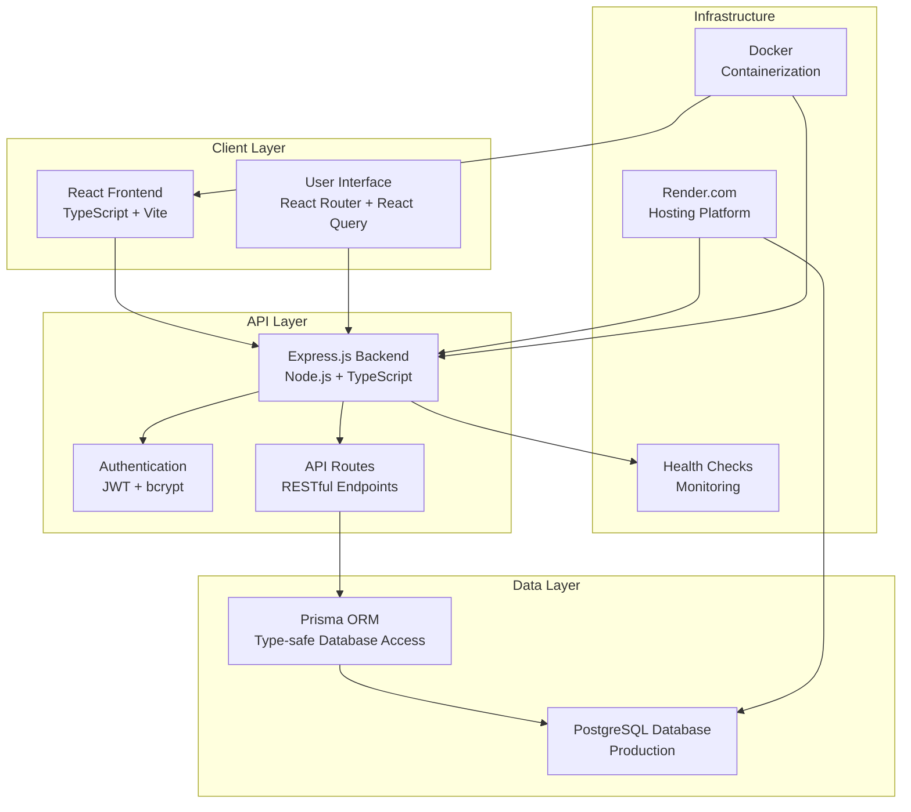
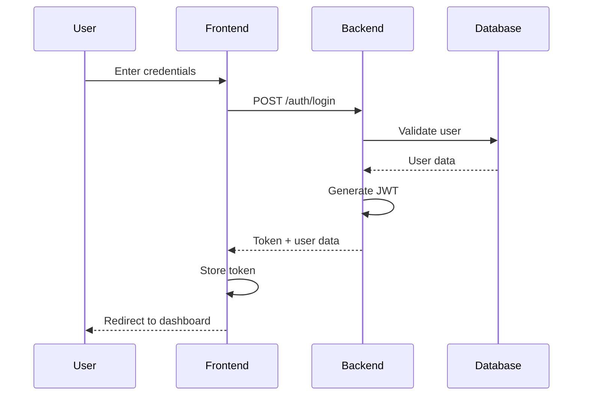
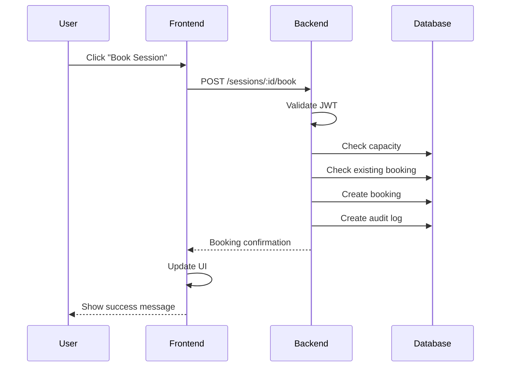
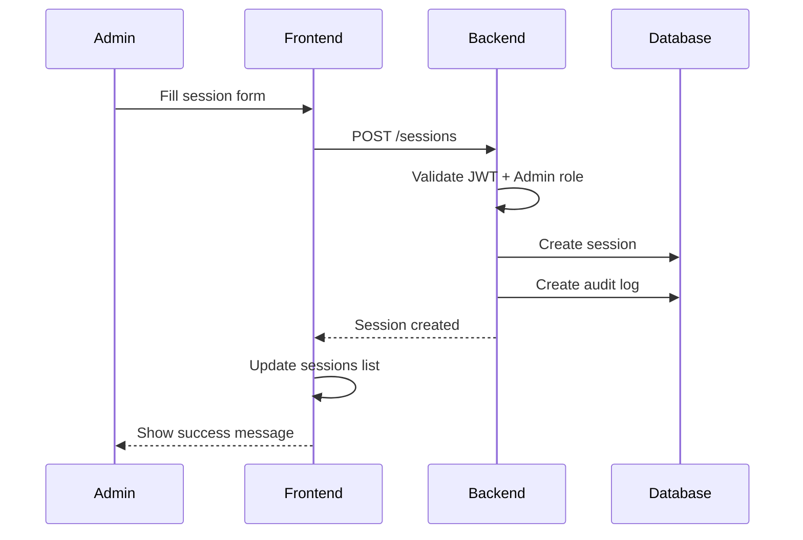
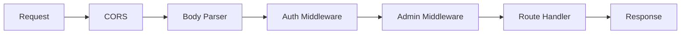
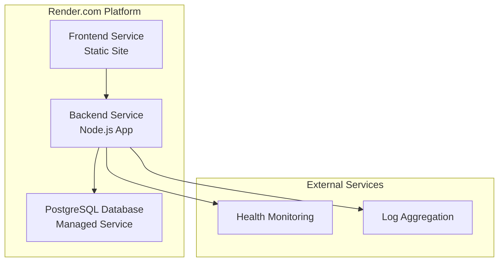
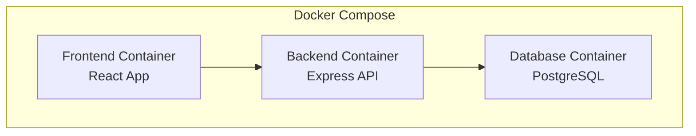

# 🏗️ ClassBook Management System - Architecture Documentation

## System Overview

ClassBook is a full-stack web application for managing class bookings, sessions, and user registrations. The system follows a modern three-tier architecture with clear separation of concerns.

## Architecture Diagram



## System Components

### 1. Frontend (React + TypeScript)

**Technology Stack:**

- **React 19.1.1** - UI framework
- **TypeScript 5.8.3** - Type safety
- **Vite 7.1.2** - Build tool and dev server
- **React Router DOM 7.8.2** - Client-side routing
- **React Query 5.85.6** - Data fetching and caching

**Key Features:**

- Responsive design with modern CSS
- Protected routes for authenticated users
- Admin-only components and features
- Real-time data synchronization
- Error handling and loading states

**Component Structure:**

```
src/
├── components/          # Reusable UI components
│   ├── Navbar.tsx      # Navigation component
│   ├── ProtectedRoute.tsx  # Route protection
│   └── AdminRoute.tsx  # Admin-only routes
├── pages/              # Page components
│   ├── Login.tsx       # Authentication
│   ├── Dashboard.tsx   # Main dashboard
│   ├── Classes.tsx     # Class management
│   ├── Sessions.tsx    # Session booking
│   ├── Bookings.tsx    # Booking management
│   └── AuditLogs.tsx   # Admin audit logs
├── context/            # React Context
│   └── AuthContext.tsx # Authentication state
├── hooks/              # Custom hooks
│   └── useAuth.ts      # Authentication hook
├── utils/              # Utility functions
│   ├── api.ts          # API client
│   └── dateUtils.ts    # Date formatting
└── types/              # TypeScript definitions
    └── index.ts        # Type definitions
```

### 2. Backend (Node.js + Express + TypeScript)

**Technology Stack:**

- **Node.js** - Runtime environment
- **Express.js 5.1.0** - Web framework
- **TypeScript 5.9.2** - Type safety
- **Prisma 6.15.0** - Database ORM
- **JWT** - Authentication tokens
- **bcryptjs** - Password hashing
- **Zod 4.1.5** - Input validation

**API Architecture:**

```
src/
├── server.ts           # Application entry point
├── middleware/         # Express middleware
│   └── auth.ts         # Authentication & authorization
├── routes/             # API route handlers
│   ├── auth.ts         # Authentication endpoints
│   ├── classes.ts      # Class management
│   ├── sessions.ts     # Session management
│   ├── bookings.ts     # Booking management
│   ├── audit-logs.ts   # Audit log access
│   └── health.ts       # Health check endpoints
├── lib/                # Core libraries
│   └── prisma.ts       # Database client
└── utils/              # Utility functions
    └── jwt.ts          # JWT utilities
```

**API Endpoints:**

- `POST /auth/register` - User registration
- `POST /auth/login` - User authentication
- `GET /health` - Health check
- `GET /health/ping` - Simple ping
- `GET /classes` - List classes
- `POST /classes` - Create class (admin)
- `GET /sessions` - List sessions
- `POST /sessions` - Create session (admin)
- `POST /sessions/:id/book` - Book session
- `GET /bookings` - User bookings
- `GET /bookings/all` - All bookings (admin)
- `DELETE /bookings/:id` - Cancel booking
- `GET /audit-logs` - Audit logs (admin)

### 3. Database (PostgreSQL + Prisma)

**Database Schema:**

```sql
-- Users table
CREATE TABLE "User" (
  id        TEXT PRIMARY KEY DEFAULT gen_random_uuid(),
  email     TEXT UNIQUE NOT NULL,
  password  TEXT NOT NULL,
  role      TEXT DEFAULT 'user',
  createdAt TIMESTAMP DEFAULT NOW(),
  updatedAt TIMESTAMP DEFAULT NOW()
);

-- Classes table
CREATE TABLE "Class" (
  id          TEXT PRIMARY KEY DEFAULT gen_random_uuid(),
  name        TEXT NOT NULL,
  description TEXT,
  createdAt   TIMESTAMP DEFAULT NOW(),
  updatedAt   TIMESTAMP DEFAULT NOW()
);

-- Sessions table
CREATE TABLE "Session" (
  id        TEXT PRIMARY KEY DEFAULT gen_random_uuid(),
  classId   TEXT NOT NULL REFERENCES "Class"(id),
  startTime TIMESTAMP NOT NULL,
  endTime   TIMESTAMP NOT NULL,
  capacity  INTEGER NOT NULL,
  createdAt TIMESTAMP DEFAULT NOW(),
  updatedAt TIMESTAMP DEFAULT NOW()
);

-- Bookings table
CREATE TABLE "Booking" (
  id        SERIAL PRIMARY KEY,
  userId    TEXT NOT NULL REFERENCES "User"(id),
  sessionId TEXT NOT NULL REFERENCES "Session"(id),
  bookedAt  TIMESTAMP DEFAULT NOW(),
  status    TEXT DEFAULT 'booked',
  UNIQUE(userId, sessionId)
);

-- Audit Logs table
CREATE TABLE "AuditLog" (
  id        TEXT PRIMARY KEY DEFAULT gen_random_uuid(),
  entity    TEXT NOT NULL,
  entityId  TEXT NOT NULL,
  action    TEXT NOT NULL,
  details   JSONB,
  timestamp TIMESTAMP DEFAULT NOW(),
  userId    TEXT REFERENCES "User"(id)
);
```

## Request Flow

### 1. User Authentication Flow



### 2. Session Booking Flow



### 3. Admin Session Creation Flow



## Security Architecture

### Authentication & Authorization

1. **JWT Tokens**: Stateless authentication with 1-day expiration
2. **Password Hashing**: bcrypt with salt rounds of 10
3. **Role-Based Access**: Admin vs User permissions
4. **Protected Routes**: Middleware validation on sensitive endpoints
5. **Input Validation**: Zod schema validation for all inputs

### Security Middleware Stack



## Deployment Architecture

### Production Environment (Render.com)



### Container Architecture (Docker)



## Data Flow Patterns

### 1. Optimistic Updates

- Frontend updates UI immediately
- API calls happen in background
- Rollback on error

### 2. Cache Management

- React Query handles caching
- Automatic invalidation on mutations
- Background refetching

### 3. Error Handling

- Consistent error response format
- User-friendly error messages
- Graceful degradation

## Performance Considerations

### Frontend

- Code splitting with React.lazy()
- Image optimization
- Bundle size optimization with Vite
- Efficient re-rendering with React Query

### Backend

- Database connection pooling
- Efficient Prisma queries
- Response compression
- Health check monitoring

### Database

- Proper indexing on foreign keys
- Unique constraints for data integrity
- Connection pooling
- Query optimization

## Monitoring & Observability

### Health Checks

- `/health` - Comprehensive system status
- `/health/ping` - Simple connectivity test
- Database connection monitoring
- Memory usage tracking

### Logging

- Structured logging with timestamps
- Error tracking and reporting
- Audit trail for all operations
- Performance metrics

### Metrics

- Request/response times
- Error rates
- Database query performance
- Memory and CPU usage

## Scalability Considerations

### Horizontal Scaling

- Stateless backend design
- Database connection pooling
- Load balancer ready
- Container orchestration support

### Vertical Scaling

- Efficient database queries
- Memory optimization
- Caching strategies
- Resource monitoring

## Development Workflow

### Local Development

1. Docker Compose for full stack
2. Hot reloading for both frontend and backend
3. Database migrations with Prisma
4. Environment variable management

### Testing Strategy

- Unit tests for business logic
- Integration tests for API endpoints
- Frontend component testing
- End-to-end testing scenarios

### CI/CD Pipeline

- Automated testing on pull requests
- Code quality checks
- Security scanning
- Automated deployment

## Future Enhancements

### Planned Features

- Real-time notifications
- Email notifications
- Advanced reporting
- Mobile app support
- Multi-tenant architecture

### Technical Improvements

- Redis caching layer
- Message queue for async processing
- Advanced monitoring with Prometheus
- Automated backup strategies
- API rate limiting

---

_This architecture document provides a comprehensive overview of the ClassBook Management System's design, implementation, and deployment strategies._
